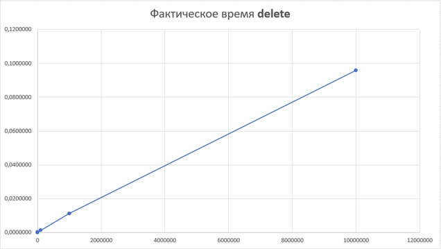

Приложение предоставляет инструмент для генерации продолжения фраз на основе начальных слов, введенных пользователем. Процесс генерации осуществляется на основе словарей, созданных из загруженных текстовых файлов, которые анализируются и сохраняют последовательности слов для предсказания наиболее вероятных последующих слов.

## Оглавление
1. [Используемые технологии](#используемые-технологии)
2. [Установка](#установка)
3. [Функциональные возможности](#функциональные-возможности)
4. [Использование](#использование)
5. [Алгоритм генерации](#алгоритм-генерации)
6. [Архитектура приложения](#архитектура-приложения)
7. [Производительность](#производительность)

## Используемые технологии
Приложение полностью написано с использованием стандартных библиотек Python, включая tkinter для создания графического интерфейса. Поэтому для установки дополнительных зависимостей не требуется.

Разработка велась на Python версии 3.12.5.

## Установка
  1.  **Клонируйте или скачайте репозиторий**

  2.  **Запустите приложение из дириктории проекта**
```
  python run.py
``` 

## Функциональные возможности

1. **Генерация продолжения фраз**: Генерация продолжения фразы на основе начальных слов, введенных пользователем, с использованием словарей, созданных из загруженных текстов.

2. **Управление словарями**:
    - **Сохранение словарей**: Сохранение сгенерированных словарей для дальнейшего использования.

    - **Дополнение словарей**: Добавление новых последовательностей слов в существующий словарь путем загрузки дополнительных текстовых файлов.

    - **Удаление словарей**: Удаление словарей, когда они больше не нужны.

    - **Генерация текста**: Генерация продолжения текста на основе выбранного словаря.

3. **Настройки генерации**:
    - **`max_generated_word_count`**: Устанавливает максимальное количество слов, которые генератор добавит к исходной фразе.

    - **`generated_without_dot`**: Определяет количество слов, после которого генератор попытается завершить предложение.

4. **Конфигурация**:
    - Приложение позволяет изменять настройки генерации через файл `config.txt`.


## Использование

1. **Загрузка текста**: Загрузите текстовый файл для создания словаря, который приложение будет использовать для генерации фраз.

2. **Управление словарями**: Дополняйте или удаляйте словари в зависимости от необходимости обновления или поддержания моделей генерации.

3. **Генерация текста**: Введите начальные слова фразы, и приложение сгенерирует продолжение на основе выбранного словаря и текущих настроек.

4. **Настройка параметров**: Измените файл `config.txt`, чтобы настроить параметры `max_generated_word_count` и `generated_without_dot` в соответствии с вашими потребностями.

   ### Интерфейс приложения
  <div align="center">
    <div style="margin-top: 40px; width: 85%;">
      
    </div>
  </div>
  
## Алгоритм генерации

1. ### Понятие n-граммы

    Основой работы алгоритма генерации текста является использование **n-грамм** — последовательностей из n слов, извлечённых из текста. 1-граммы называют униграммами, 2-граммы называют биграммами, 3-граммы — триграммами. n-граммы позволяют прогнозировать следующее слово на основе предыдущих одного или двух слов.
    #### Примеры n-грамм:

    Рассмотрим фразу: **"мама мыла раму и кошку"**.
    - Униграммы:
      - "мама"
      - "мыла"
      - "раму"
      - "и"
      - "кошку"

    - Биграммы:
      - "мама мыла"
      - "мыла раму"
      - "раму и"
      - "и кошку"

    - Триграммы:
      - "мама мыла раму"
      - "мыла раму и"
      - "раму и кошку"

2. ### Алгоритм
    #### Анализ текста и создание словаря:
    - **Разбиение текста на слова и предложения.** Разделителями предложений являются символы ".", "!", "?", ";", "(", ")". Словом считается последовательность символов кирилицы, латиницы,  запятых и двоеточий. Все остальные символы в предложении игнорируются. В конце предложения в приказном порядке ставится точка, которая рассматривается как его последнее слово.
    - **Разбиение каждого приложения на униграммы и биграммы.** Униграммы представляют собой отдельные слова, биграммы — последовательности из двух слов.
    - **Создание частотного словаря.** Для каждой униграммы и биграммы составляется частотный словарь, содержащий все возможные, слова которые следовали за n-граммой, и их количество.
    - **Выбор самых частых продолжений.** По частотному словарю составляется список из двух самых частых продолжений, при одинаковом количестве слов, приоритет отдается лексикографически меньшему слову.

    #### Генерация продолжения фразы:
    - Пользователь вводит начальные слова фразы.
    - Алгоритм ищет в словаре униграммы или биграммы, совпадающие с последними одним или двумя словами введённой фразы.
    - Если найдена подходящая биграмма, следующее слово выбирается на основе этой биграммы. Если биграмма не найдена, используется униграмма.
    - Из списка двух самых частых продолжений n-граммы выбирается случайное продолжение, но предпочтение отдается точке, если уже достигнуто `generated_without_dot` слов, и не точке в обратном случае.
    - Этот процесс повторяется до тех пор, пока не будет добавлено максимальное количество слов (на основе настройки `max_generated_word_count`), или не будет достигнута точка, или в словаре не окажется биграммы и униграммы.

3. ### Пример генерации:

    Предположим, что у нас есть следующий текст для анализа:

    `Мама мыла раму. Сестра мыла раму и кошку.`

    #### Частотный словарь будет содержать:

        "мама": {"мыла": 1},


        "мама мыла": {"раму": 1},


        "мыла": {"раму": 2},


        "мыла раму": {".": 1, "и": 1},


        "раму": {".": 1, "и": 1},


        "сестра": {"мыла": 1},


        "сестра мыла": {"раму": 1},


        "раму и": {"кошку": 1},


        "и": {"кошку": 1},


        "и кошку": {".": 1},


        "кошку": {".": 1}


    #### Список самых частых продолжений будет выглядеть:

        "мама": ["мыла"],


        "мама мыла": ["раму"],


        "мыла": ["раму"],


        "мыла раму": [".", "и"],


        "раму": [".", "и"],


        "сестра": ["мыла"],


        "сестра мыла": ["раму"],


        "раму и": ["кошку"],


        "и": ["кошку"],


        "и кошку": ["."],


        "кошку": ["."]


    Теперь если пользователь введет слово "мама":

    (Для упрощения примера опустим параметры: `generated_without_dot` и `max_generated_word_count`, их влияние очевидно из описания алгоритма)


    #### Шаг 1: Введена фраза `"мама"`

    - Алгоритм находит униграмму `"мама"` в словаре n-грамм.
    - Возможное продолжение: `["мыла"]`.

    #### Шаг 2: Фраза теперь выглядит так: `"мама мыла"`

    - Алгоритм находит биграмму `"мама мыла"` в словаре n-грамм.
    - Возможное продолжение: `["раму"]`.

    #### Шаг 3: Фраза теперь выглядит так: `"мама мыла раму"`

    - Алгоритм находит биграмму `"мыла раму"` в словаре n-грамм.
    - Возможные продолжения: `[".", "и"]`. 
    - Если будет выбрана ".", генерация прекратиться и сгенерированная фраза будет выглядеть:

      `мама мыла раму.`
    - Если будет выбрана "и", генерация продолжается:

    #### Шаг 4: Фраза теперь выглядит так: `"мама мыла раму и"`

    - Алгоритм находит биграмму `"раму и"` в словаре n-грамм.
    - Возможное продолжение: `["кошку"]`.

    #### Шаг 5: Фраза теперь выглядит так: `"мама мыла раму и кошку"`

    - Алгоритм снова находит униграмму `"и кошку"` в словаре n-грамм.
    - Возможное продолжение: `["."]`. 
    - Т.к выбрана "." генерация прекратиться и сгенерированная фраза будет выглядеть:
    `"мама мыла раму и кошку."`

    #### Итог: Сгенерированная фраза может выглядеть как:
    `"мама мыла раму."`

    `"мама мыла раму и кошку."`

## Архитектура приложения
В приложении используется архитектура MVC (Model-View-Controller), обеспечивающая четкое разделение логики программы, пользовательского интерфейса и управления данными. Диаграмма классов, иллюстрирующая структуру и взаимодействие компонентов, представлена на следующем изображении.

<div style="text-align: center;">
  
</div>

## Производительность
1. ### Асимптотическая сложность методов модели

    n - количество символов входного текста
- **`read_and_update`**
   - Составляющие операции:
     - `read_file` — O(n)
     - `parse_text` — O(n)
     - `create_count_dict` — O(n)
     - `update_dicts_by_count_dict` — O(2n)
     - `save_model` — O(n)
   - Суммарная сложность: O(5n) = O(n)

- **`open_model`**
   - Сложность: O(n)

- **`create_new`**
   - Сложность: O(1)

- **`delete`**
   - Сложность: O(n)

- **`generate`**
   - Сложность: O(1)
2. ### Фактическое время работы методов модели
    Измерения проводились с помощью встроенного модуля `timeit`, на случайно сгенерированных текстах длиной от 100 до 10,000,000 символов. Каждый метод запускался 100 раз, и фиксировалось наименьшее время выполнения. Время работы приведено в секундах.
    #### Таблица времени работы методов
    <div align="center">
    
    | Метод             | n = 100         | n = 1,000       | n = 10,000       | n = 100,000     | n = 1,000,000   | n = 10,000,000  |
    |-------------------|-----------------|-----------------|------------------|-----------------|-----------------|-----------------|
    | `read_and_update` | 0,00055         | 0,00178         | 0,01251          | 0,11987         | 1,20029         | 11,66605        |
    | `open_model`      | 0,00039         | 0,00202         | 0,00476          | 0,03384         | 0,29329         | 2,57057         |
    | `create_new`      | 0,00019         | 0,00022         | 0,00021          | 0,00030         | 0,00027         | 0,00030         |
    | `delete`          | 0,00007         | 0,00009         | 0,00023          | 0,00128         | 0,01126         | 0,09585         |   
    | `generate`        | 0,00015         | 0,00015         | 0,00019          | 0,00021         | 0,00024         | 0,00022         |
    
    </div>

  
   #### Графики времени выполнения

   На графиках ниже приведена зависимость времени выполнения от размера входных данных. По оси ординат — размер входных данных в символах, по оси абсцисс — время выполнения в секундах.
<div align="center">

  <div style=" margin-top: 40px; width:70%;">
    
  </div>


  <div style="margin-top: 40px; width:70%;">
    
  </div>


 
  <div style="margin-top: 40px; width:70%;">
    
  </div>


  <div style="margin-top: 40px; width:70%;">
    
  </div>


  <div style="margin-top: 40px; width:70%;">
    
  </div>
</div>